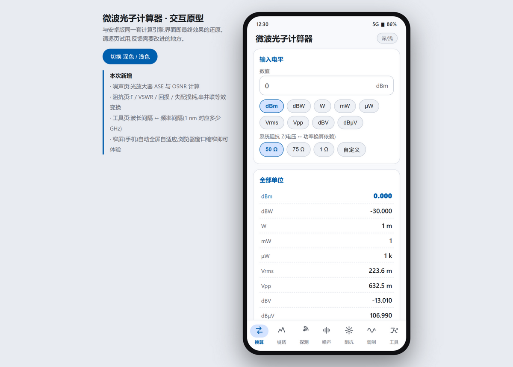

# PhotonCalc — Microwave Photonics Power Calculator

English | [中文说明](README.zh-CN.md)

A power unit calculator for microwave photonics / optical communication lab work.
Native Android (Kotlin + Jetpack Compose), Material 3, light/dark adaptive,
**fully offline — no INTERNET permission, collects nothing**.

> Note: the app UI and the bundled documents are written in Chinese (微波光子计算器).
> The formulas are universal; a bilingual formula audit report is linked below.



## Features (7 pages)

| Page | What it does |
|------|--------------|
| Convert | 9-unit live conversion across W / mW / µW / dBm / dBW / V rms / V pp / dBV / dBµV; system impedance 50 / 75 / 1 Ω / custom |
| Cascade | Input level (dBm / Vrms / Vpp) through multiple gain/loss stages (dB); output in all units |
| Detection | Optical power (dBm / mW) + responsivity (A/W) → photocurrent, load voltage, dissipation |
| Noise | Electrical thermal floor (kTB + NF); EDFA ASE PSD / integrated power / OSNR (bandwidth in nm or GHz) |
| Impedance | Reflection coefficient Γ, VSWR, return loss, mismatch loss, reflected power; series ↔ parallel (Q) transformation |
| Modulator | Mach-Zehnder modulator: Vπ, push-pull/single-arm, quadrature bias, small-signal modulation depth m, phase swing |
| Tools | Wavelength ↔ frequency ↔ photon energy; Δλ ↔ Δf (1 nm ≈ 124.8 GHz @ 1550 nm); crash diagnostics |

A **no-install web prototype** `prototype.html` shares the same calculation engine —
open it in any browser (desktop or mobile).

## Formula correctness

Both implementations were cross-audited against standard test vectors:
33 JUnit tests on the Kotlin engine, plus 74 assertions executed directly against the
JavaScript engine inside `prototype.html`. All pass.
Formula provenance (Pozar, *Microwave Engineering*; Agrawal, *Fiber-Optic Communication Systems*;
SI constant definitions) is documented in the
[formula audit report](tools/公式审计报告.md) (Chinese), reproducible via [tools/audit.js](tools/audit.js).

Spot checks:

- 0 dBm = 1 mW = 223.6 mV rms = 632 mV pp = +107 dBµV (50 Ω); 10 dBm = 2 V pp (50 Ω)
- kTB @ 290 K = −174 dBm/Hz; 1 GHz bandwidth, NF 3 dB → −80.98 dBm
- EDFA (G 20 dB, NF 5 dB) ASE @ 0.1 nm, 1550 nm → −33 dBm, matching the G + NF − 58 rule of thumb
- 75 Ω load on 50 Ω system: Γ = 0.2, VSWR = 1.5, RL = 13.98 dB, ML = 0.18 dB

## Build

Requirements: JDK 17, Android SDK (compileSdk 35).

- **Android Studio**: open the repo root and let Gradle sync.
- **Command line**:

```bash
./gradlew assembleDebug        # output: app/build/outputs/apk/debug/app-debug.apk
./gradlew testDebugUnitTest    # formula unit tests
```

Tip for mainland-China networks: swap the Gradle `distributionUrl` in
`gradle/wrapper/gradle-wrapper.properties` for
`https://mirrors.cloud.tencent.com/gradle/gradle-8.9-bin.zip`;
Alibaba/Tencent Maven mirrors are already configured first in `settings.gradle.kts`.

## Engineering

- **Crash reporting**: uncaught exceptions are logged to app-private storage (last 5 kept),
  viewable under Tools → 运行诊断; no third-party SDK
- **Performance**: debug builds ship StrictMode + frame-jank monitoring; zero overhead in release
- **Release**: R8 minify + resource shrinking (≈ 1.1 MB); signing keys are excluded from the repo
  (`.gitignore` covers `keystore.properties` / `*.jks`) — provide your own to build a signed APK
- **CI**: GitHub Actions runs the unit tests and publishes a debug APK on every push

## Disclaimer

This tool is intended for engineering estimates. Values are nominal, idealized-model results —
re-check against device datasheets and your system's actual conventions before making
measurement or design decisions.

## License

[MIT](LICENSE)
